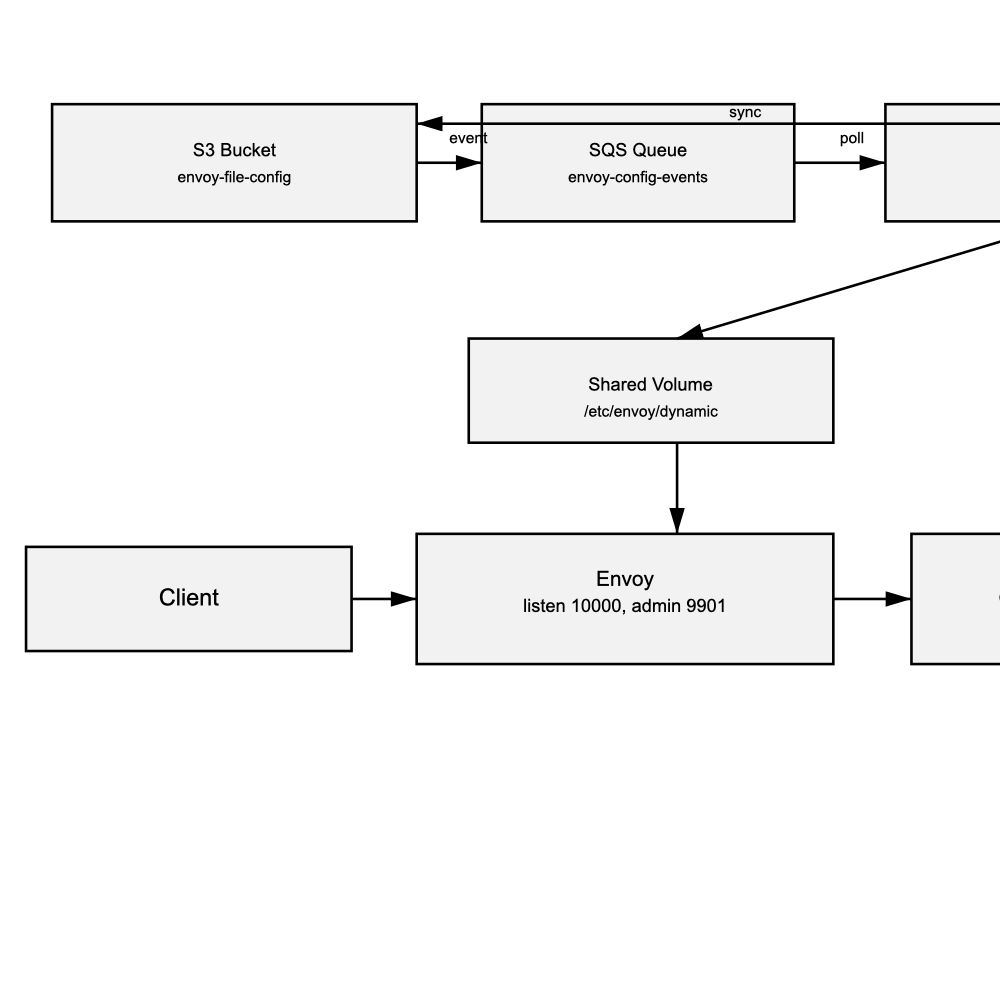

# Compilar y publicar Envoy en ECR

Esta carpeta contiene los archivos mínimos necesarios para construir la imagen de Envoy que lee
sus recursos dinámicos desde `/etc/envoy/dynamic` en tiempo de ejecución.

## Compilar y publicar

```bash
aws ecr get-login-password --region us-east-1 | \
  docker login --username AWS --password-stdin 758208602079.dkr.ecr.us-east-1.amazonaws.com

# Compilar para ECS/Fargate (linux/amd64)
docker buildx build --platform linux/amd64 -t envoy:latest -f Dockerfile . --load
docker tag envoy:latest 758208602079.dkr.ecr.us-east-1.amazonaws.com/envoy:latest
docker push 758208602079.dkr.ecr.us-east-1.amazonaws.com/envoy:latest
```

Si el repositorio aún no existe:

```bash
aws ecr create-repository --repository-name envoy --region us-east-1
```

## Bucket S3 y sincronización

Crea el bucket y sincroniza tus archivos de configuración dinámica:

```bash
aws s3 mb s3://envoy-file-config --region us-east-1
aws s3 sync ../ s3://envoy-file-config/ --exclude "*" --include "lds.yaml" --include "cds.yaml" --include "eds.yaml" --include "rds.yaml"
```

## Resumen de CloudFormation

`cloudformation.yaml` despliega un servicio ECS Fargate con dos contenedores:

- `envoy` (usa la imagen de ECR) y espera a que existan `cds.yaml`/`lds.yaml`.
- `s3-sync` (aws-cli) sincroniza continuamente la config desde S3 al volumen compartido.

También crea:

- log group en CloudWatch (`/ecs/envoy`)
- roles IAM para ejecución y tarea (con permiso de lectura a S3)

El bucket S3 se crea por separado en `bucket.yaml`.



## Outlier detection

### Outlier que cubre 5xx + timeouts (recomendado para “408”)

```bash
outlier_detection:
  interval: 10s
  base_ejection_time: 30s
  max_ejection_time: 300s
  max_ejection_percent: 20

  # 5xx del upstream
  consecutive_5xx: 5
  enforcing_consecutive_5xx: 100

  # ✅ timeouts/resets/etc (lo que típicamente “equivale” a 408)
  consecutive_gateway_failure: 5
  enforcing_consecutive_gateway_failure: 100

  # opcional (errores originados localmente)
  consecutive_local_origin_failure: 5
  enforcing_consecutive_local_origin_failure: 100

  split_external_local_origin_errors: true
```

### Para “incluir 403 y 408” de verdad: mapearlos a 503 (solo cuando convenga)

Si en tu sistema 403 y 408 significan “esta instancia está rota/mal configurada”, entonces conviértelos a 503 para que:
• el router lo vea como 5xx
• el outlier lo cuente y expulse ese host

Opción simple: Lua filter (muy usado para esto)

En tu http_connection_manager, agrega el filtro Lua antes del router:

```bash
http_filters:
- name: envoy.filters.http.lua
  typed_config:
    "@type": type.googleapis.com/envoy.extensions.filters.http.lua.v3.Lua
    inline_code: |
      function envoy_on_response(handle)
        local status = handle:headers():get(":status")

        -- Solo tocar respuestas que vienen del upstream (evita cambiar 403 de auth local, etc.)
        local upstream_time = handle:headers():get("x-envoy-upstream-service-time")
        if upstream_time == nil then
          return
        end

        -- Mapear 403/408 -> 503 (para que outlier lo trate como falla)
        if status == "403" or status == "408" then
          handle:headers():replace(":status", "503")
          handle:headers():add("x-outlier-mapped-from", status)
        end
      end
- name: envoy.filters.http.router
  typed_config:
    "@type": type.googleapis.com/envoy.extensions.filters.http.router.v3.Router
```
